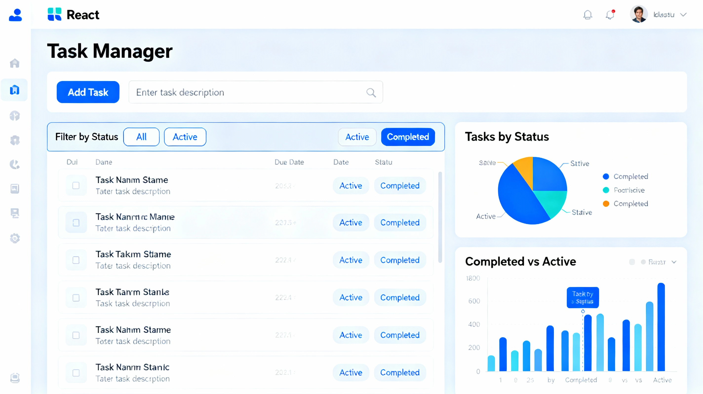

# React Task Manager - Learning Project

## 📋 Project Overview

Welcome to your React learning challenge! This project is designed to help you apply all the main concepts you've learned from the React documentation in a single, comprehensive application.

## 🎯 Problem Statement

Build a **Task Manager Application** that allows users to manage their daily tasks with full CRUD (Create, Read, Update, Delete) functionality. This project will test your understanding of all React main concepts in a practical, real-world scenario.

## 🚀 Application Requirements

### Core Features

Your Task Manager application must include the following features:

1. **Add New Tasks**
   - Users can add tasks with a title, description, and priority level (Low, Medium, High)
   - Form validation to ensure required fields are filled
   - Clear the form after successful submission

2. **Display Task List**
   - Show all tasks in a organized list
   - Display task details: title, description, priority, status, and creation date
   - Visual distinction between completed and pending tasks

3. **Edit Tasks**
   - Allow users to edit existing task details
   - Pre-populate the form with current task data when editing
   - Update the task list after saving changes

4. **Delete Tasks**
   - Remove tasks from the list
   - Show a confirmation message before deletion

5. **Mark Tasks as Complete/Incomplete**
   - Toggle task status between complete and incomplete
   - Visual feedback for completed tasks (e.g., strikethrough, different color)

6. **Filter Tasks**
   - Filter by status: All, Active (incomplete), Completed
   - Filter by priority: All, Low, Medium, High

7. **Search Functionality**
   - Search tasks by title or description
   - Real-time search results

8. **Local Storage Persistence**
   - Save all tasks to browser's local storage
   - Load tasks from local storage on app initialization
   - Tasks should persist even after page refresh

9. **Task Statistics**
   - Display total number of tasks
   - Show count of completed vs pending tasks
   - Calculate completion percentage

10. **Empty State Handling**
    - Show appropriate message when no tasks exist
    - Display message when filters return no results

## 📚 React Main Concepts to Apply

Your implementation **must demonstrate** the following React concepts:

### 1. **Hello World & JSX** (Concepts 1-2)
- Use JSX syntax throughout the application
- Properly structure your component tree
- Use JavaScript expressions within JSX

### 2. **Rendering Elements** (Concept 3)
- Render dynamic content based on state
- Update UI efficiently when state changes

### 3. **Components and Props** (Concept 4)
- Create multiple reusable components (minimum 5):
  - `App` - Main container component
  - `TaskForm` - Form for adding/editing tasks
  - `TaskList` - Container for all tasks
  - `TaskItem` - Individual task display
  - `FilterBar` - Filter and search controls
  - `Statistics` - Display task statistics
- Pass data between components using props
- Use both functional and class components (if comfortable with both)

### 4. **State and Lifecycle** (Concept 5)
- Manage application state (tasks, filters, edit mode)
- Use lifecycle methods or `useEffect` hook for:
  - Loading tasks from local storage on mount
  - Saving tasks to local storage when state changes
- Handle state updates properly

### 5. **Handling Events** (Concept 6)
- Handle form submissions
- Handle button clicks (add, edit, delete, toggle complete)
- Handle input changes for search and filters
- Prevent default form behavior where necessary

### 6. **Conditional Rendering** (Concept 7)
- Show/hide edit form based on edit mode
- Display empty state when no tasks exist
- Show different UI for completed vs incomplete tasks
- Display "no results" message when filters match nothing

### 7. **Lists and Keys** (Concept 8)
- Render task list dynamically using `.map()`
- Use unique `key` prop for each task item
- Handle dynamic list updates (add, remove, edit)

### 8. **Forms** (Concept 9)
- Create controlled form components
- Handle multiple input fields (text, textarea, select)
- Implement form validation
- Manage form state
- Handle form submission and reset

### 9. **Lifting State Up** (Concept 10)
- Share state between sibling components through parent
- Lift task state to App component
- Pass state and state-updating functions as props

### 10. **Composition vs Inheritance** (Concept 11)
- Use composition to build complex UI from simple components
- Avoid inheritance, use component composition instead
- Create reusable, composable components

### 11. **Thinking in React** (Concept 12)
- Break UI into component hierarchy
- Build a static version first, then add interactivity
- Identify where state should live
- Add inverse data flow (child to parent communication)

## 🎨 Bonus Features (Optional)

To further enhance your learning, consider adding:

1. **Use React Hooks**
   - Convert components to use `useState` and `useEffect`
   - Create custom hooks (e.g., `useLocalStorage`)

2. **Styling**
   - Add CSS for better visual presentation
   - Use CSS modules or styled-components
   - Make the app responsive

3. **Advanced Features**
   - Task categories/tags
   - Due dates with date picker
   - Sort tasks by different criteria
   - Task priority color coding
   - Animation for task additions/deletions

4. **Code Organization**
   - Separate components into different files
   - Create a proper folder structure
   - Use meaningful component and variable names

## 📁 Suggested Project Structure

```
task-manager/
├── public/
│   └── index.html
├── src/
│   ├── components/
│   │   ├── App.js
│   │   ├── TaskForm.js
│   │   ├── TaskList.js
│   │   ├── TaskItem.js
│   │   ├── FilterBar.js
│   │   └── Statistics.js
│   ├── styles/
│   │   └── App.css
│   ├── utils/
│   │   └── helpers.js (optional)
│   └── index.js
├── package.json
└── README.md
```

## ✅ Evaluation Criteria

Your project will be evaluated based on:

1. **Concept Application (40%)**
   - Correct implementation of all 12 main React concepts
   - Proper use of state and props
   - Appropriate component structure

2. **Functionality (30%)**
   - All required features work as expected
   - No bugs or errors in console
   - Proper error handling

3. **Code Quality (20%)**
   - Clean, readable code
   - Meaningful variable and function names
   - Proper code organization and file structure
   - Comments where necessary

4. **User Experience (10%)**
   - Intuitive interface
   - Smooth interactions
   - Visual feedback for user actions
   - Responsive design

## 🛠️ Getting Started

1. **Setup**
   ```bash
   npx create-react-app task-manager
   cd task-manager
   npm start
   ```

2. **Plan Your Components**
   - Sketch out your component hierarchy
   - Identify what state each component needs
   - Determine where state should live

3. **Build Incrementally**
   - Start with static components
   - Add state one feature at a time
   - Test each feature before moving to the next

4. **Test Thoroughly**
   - Test all CRUD operations
   - Test edge cases (empty list, filters with no results)
   - Test local storage persistence (refresh the page)

## 📤 Submission Guidelines

When you're ready for evaluation, please provide:

1. **Complete Source Code**
   - All component files
   - CSS files
   - Package.json

2. **Updated README.md**
   - How to run your project
   - Features you implemented
   - Challenges you faced
   - What you learned

3. **Screenshots** (Optional but recommended)
   - Show different states of your application
   - Demonstrate key features

## 💡 Tips for Success

- **Start Simple**: Build a basic version first, then add features
- **One Concept at a Time**: Focus on implementing one React concept properly before moving to the next
- **Console is Your Friend**: Use console.log() to debug state and props
- **Read Error Messages**: React error messages are helpful - read them carefully
- **Refer to Docs**: Don't hesitate to revisit the React documentation
- **Comment Your Code**: Especially where you're applying specific React concepts
- **Test Frequently**: Test each feature as you build it
- **Don't Over-complicate**: Focus on demonstrating concepts clearly over complex features

## 📖 Learning Resources

- [React Official Documentation](https://reactjs.org/docs/getting-started.html)
- [React Hooks Documentation](https://reactjs.org/docs/hooks-intro.html)
- [Thinking in React](https://reactjs.org/docs/thinking-in-react.html)

## 🎓 After Completion

Once you've completed this project, you will have:

- Built a real-world React application from scratch
- Applied all React main concepts in practice
- Gained confidence in component design and state management
- Created a portfolio project to showcase your skills

---

**Good luck with your React learning journey! Take your time, enjoy the process, and don't hesitate to experiment. The best way to learn React is by building!** 🚀

---

## 📝 Your Implementation Notes

(Add your notes here about your implementation, challenges faced, and what you learned)
## Interface Should look like this:
